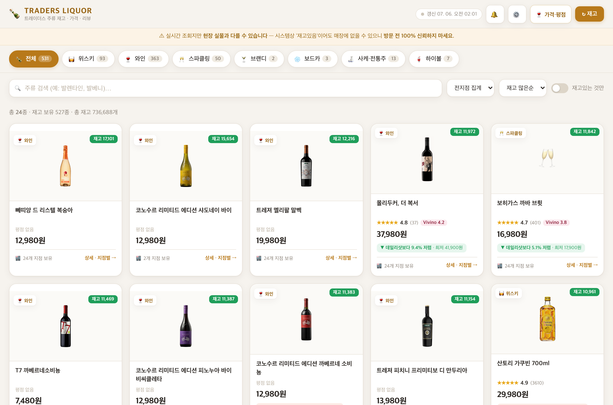
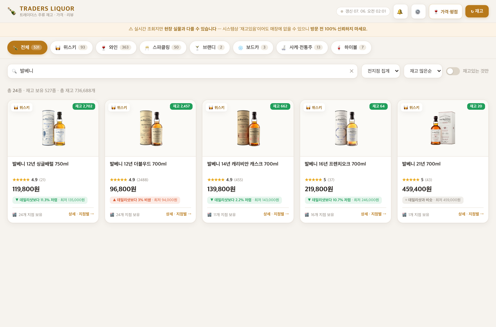
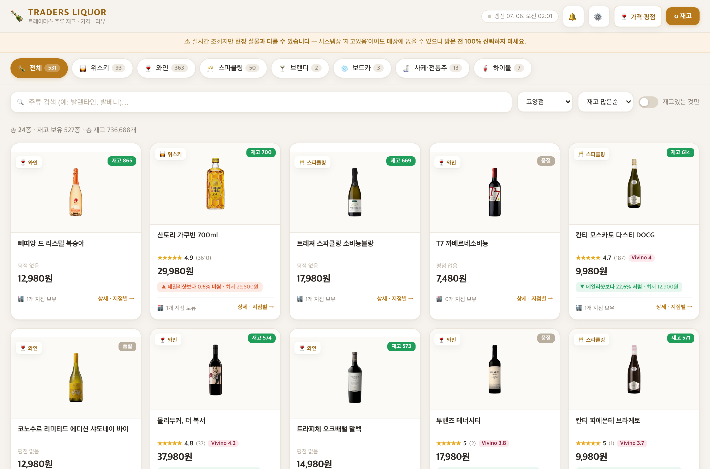
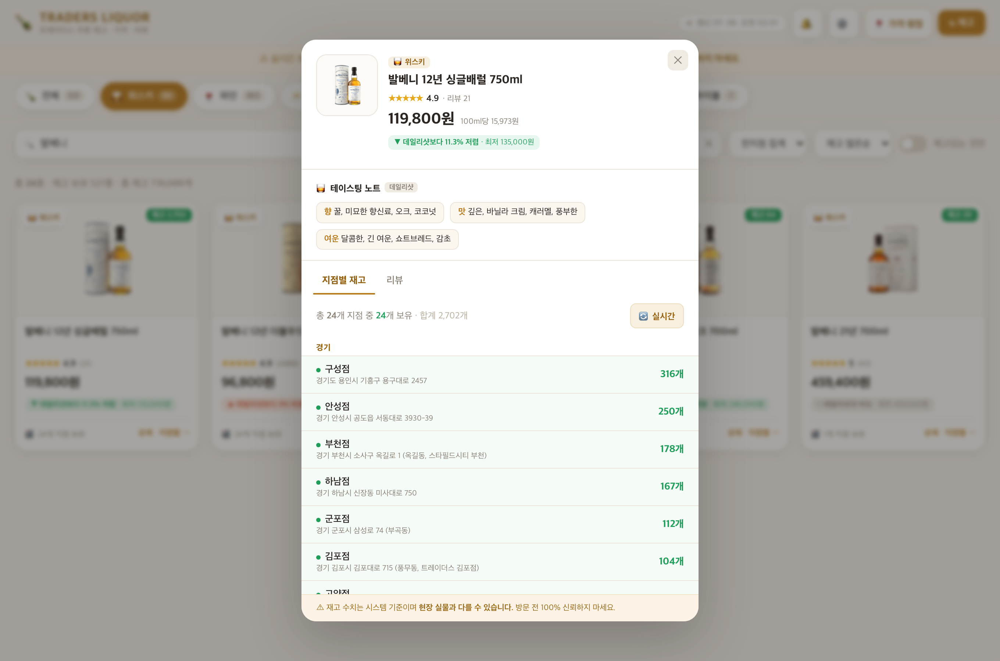
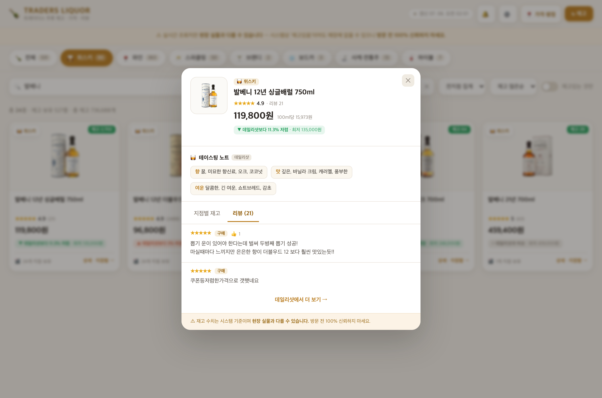

# 📖 사용 가이드 — 주락 酒樂

설치할 것 없습니다. **아래 주소만 열면 끝**이에요.

## 🔗 https://ai-md.github.io/

**주락(酒樂)** 은 두 가지를 한곳에서 제공합니다. 상단 탭으로 전환하세요.
- **🛒 주락 딜** — 트레이더스 주류 재고·최저가
- **🍽 주락 다이닝** — 서울·수도권 콜키지프리 식당

> ⚠️ 재고·콜키지 정책은 **현장과 다를 수 있습니다.** 방문 전 100% 신뢰하지 마시고, 콜키지는 전화 확인을 권장합니다.
> 갱신: 주류 재고 **매일 저녁**·데일리샷 가격 **매일 아침**·콜키지프리 식당 **주 3회**. (조회 전용)

---

# 🛒 주락 딜 (주류 재고)

## 1. 메인 화면
카테고리(위스키/와인/…)별로 주류가 카드로 보입니다. 각 카드에서:
- **재고 수량**(우상단) · **품절 여부**
- **★ 평점(리뷰 수)** · **Vivino**(와인 평가 점수)
- **가격** · **데일리샷 대비 몇 % 저렴/비쌈**
- **보유 지점 수**

## 2. 카테고리 · 검색 · 지점 필터
- **카테고리 탭** — 위스키 / 와인 / 스파클링 / 브랜디 / 사케·전통주 / 하이볼 …
- **검색창** — 상품명 입력 (예: `발베니`, `까베르네`)
- **매장 선택** — `전지점 집계` 또는 특정 지점만
- **정렬** — 재고 많은순 / 이름순 / 가격순
- **재고있는 것만** — 품절 숨기기

| 검색 | 특정 지점 보기 |
|---|---|
|  |  |

## 3. 상품 상세 (카드 클릭)
상품을 누르면 상세가 열립니다:
- **가격 · 평점 · Vivino · 데일리샷 비교**
- **테이스팅 노트** (향 / 맛 / 여운)
- **지점별 재고** 탭 — 전 지점 재고 수량 · **📍 가까운 순**(위치 허용 시) · 매장별 가격
- **💸 최저가처** 탭 — 데일리샷 최저가 판매점(이름·가격·주소·영업시간) + **📍 카카오맵 · 🚗 길찾기**
- **지점별 재고** 행마다 **🗺 지도**(카카오맵) 링크 — 트레이더스 24개 지점 위치 바로 확인
- **리뷰** 탭 — 실사용 후기

| 상세 · 지점별 재고 | 리뷰 |
|---|---|
|  |  |

---

# 🍽 주락 다이닝 (콜키지프리 식당)

상단 **🍽 주락 다이닝** 탭 → 서울·수도권 **콜키지프리 식당**(내 술 반입 가능)을 지도·리스트로 봅니다.
- **카카오맵 평점 3.5+** 만 선별, 평점 높은 순 정렬
- **검색**(식당/지역) · **지역 필터**
- **📍 내 주변** — 브라우저 위치 허용 시 **가까운 식당순** + 거리(km) + 내 위치 지도 표시
- 각 식당: ★평점·리뷰수·업종·주소·전화 + **카카오맵 · 길찾기** 링크

> ⚠️ 콜키지(반입) 정책은 매장 사정으로 바뀔 수 있어요. **방문 전 전화 확인**을 권장합니다.

---

## 🔔 알림 받기 — 무료 (주락 딜)
**🔥특가(데일리샷 20%↓)·⏰품절임박·🎉재입고·🆕신상·💸최저가 변동** 이 생기면 자동으로 알려줍니다.
방법은 두 가지 — **① ntfy 앱(폰 푸시)** 또는 **② 이메일**.

### 방법 ① ntfy 앱 (폰 푸시, 로그인 불필요)
> 토픽 이름: **`traders-liquor-kr-alerts`**

**📱 안드로이드**
1. **Play 스토어**에서 **`ntfy`** 검색 → 설치 ([바로가기](https://play.google.com/store/apps/details?id=io.heckel.ntfy))
2. 앱 열기 → 우측 하단 **＋** 버튼
3. **Topic name** 칸에 `traders-liquor-kr-alerts` 입력 → **Subscribe**
4. 끝! (로그인·회원가입 없음) — 배터리 설정에서 ntfy 백그라운드 허용을 켜두면 더 확실해요.

**🍎 아이폰(iOS)**
1. **App Store**에서 **`ntfy`** 검색 → 설치 ([바로가기](https://apps.apple.com/app/ntfy/id1625396347))
2. 앱 열기 → 우측 상단 **＋**
3. **Topic** 칸에 `traders-liquor-kr-alerts` 입력 → **Subscribe**
4. 알림 권한 요청이 뜨면 **허용**. 끝!

> 💡 페이지의 **🔔 알림 받기** 버튼을 누르면 토픽 이름을 **복사**할 수 있어요. 앱에 붙여넣기만 하면 됩니다.

**💻 PC(앱 없이)**: **[ntfy.sh/app](https://ntfy.sh/app)** 열기 → **＋ Subscribe** → 토픽 `traders-liquor-kr-alerts` 입력 → 브라우저 알림 **허용**
> ⚠️ 주소창에 `ntfy.sh/토픽`을 직접 치면 404가 날 수 있어요. 꼭 **ntfy.sh/app** 안에서 토픽을 추가하세요.

### 방법 ② 이메일 구독
폰 앱이 부담되면 이메일로 받으세요. 페이지의 **📧 이메일 구독** 버튼 → 이메일 입력 → 제출.
특가·재입고가 생기면 **메일로 정리해서** 보내드립니다. (수신거부는 회신)

> 알림은 계정·개인정보 없이 받을 수 있어요. 언제든 앱에서 구독 해제(또는 메일 회신)로 끌 수 있습니다.

---

## ❓ 자주 묻는 질문
- **로그인 필요해요?** 아니요. 그냥 주소만 열면 됩니다.
- **데이터가 오래됐어요?** 주류 재고는 **매일 저녁 1회**, 데일리샷 가격·평점은 **매일 아침**, 콜키지프리 식당은 **주 3회(월·수·금)** 갱신됩니다. 갱신 시각은 우측 상단에 표시돼요.
- **알림은 하루 몇 번 와요?** 특가·재입고 등은 **하루 2회(오전 9시·오후 6시)** 정리해 발송합니다.
- **알림은 어떻게 꺼요?** ntfy 앱에서 토픽 구독만 해제하면 됩니다.
